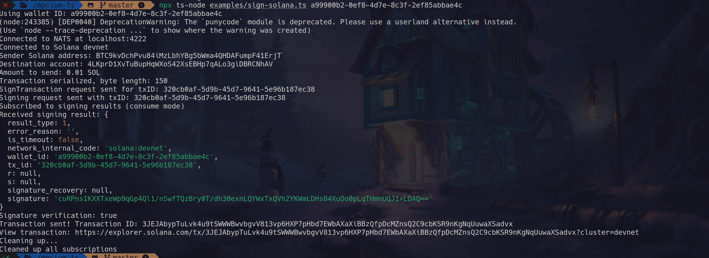

# Mpcium TypeScript Client

A TypeScript client for interacting with Mpcium Multi-Party Computation (MPC) service to generate and manage wallets and sign transactions across multiple blockchains.

### Client sign



### MPCIUM nodes coordinate to sign transaction


## Prerequisites

Important: Before using this TypeScript client, you need to set up the Mpcium MPC nodes. The nodes provide the underlying MPC infrastructure that this client connects to.
Please follow the installation and setup instructions at [mpcium](https://github.com/fystack/mpcium) to deploy the required MPC nodes. Typically, you'll need to run multiple nodes (e.g., 3 nodes in a 2-of-3 threshold setup) before using this client.

```sh
# Example of starting MPC nodes (after installing from the repository)
mpcium start -n node0
mpcium start -n node1
mpcium start -n node2
```

## Overview

Mpcium is a service that provides secure key management and transaction signing using Multi-Party Computation. This client library allows you to:

- Generate cryptographic keys without exposing private key material
- Sign transactions for multiple blockchain networks
- Receive cryptographic operation results through event subscriptions

## Supported Key Types and Blockchains

- **ECDSA**: Bitcoin, Ethereum, and other EVM-compatible chains
- **EdDSA**: Solana, Polkadot, Cardano, and other EdDSA-based chains

## Installation

```bash
npm install @fystack/mpcium-ts
```

## Creating a client

- User need to generate `event_initiator.key` through [mpcium-cli](https://github.com/fystack/mpcium/blob/master/INSTALLATION.md) before using this client

```ts
import { connect } from "nats";
import { MpciumClient } from "@fystack/mpcium-ts";

async function setupClient() {
  // First, establish NATS connection
  const nc = await connect({ servers: "nats://localhost:4222" });

  // Create client with key path
  const mpcClient = await MpciumClient.create({
    nc: nc,
    keyPath: "./event_initiator.key",
  });

  return mpcClient;
}
```

### Encrypted client (Recommended for production usage)

```ts
const mpcClient = await MpciumClient.create({
  nc: nc,
  keyPath: "./event_initiator.key.age",
  password: "your-secure-password", // Stored and load secure vault like KMS, Hashicorp vault
});
```

### Generating a Wallet

```ts
import { connect } from "nats";
import { MpciumClient } from "@fystack/mpcium-ts";
import fs from "fs";

async function generateWallet() {
  const nc = await connect({ servers: "nats://localhost:4222" });
  const mpcClient = await MpciumClient.create({
    nc: nc,
    keyPath: "./event_initiator.key",
  });

  // Store wallets in a file (for testing only)
  const walletsFile = "./examples/wallets.json";
  const wallets = fs.existsSync(walletsFile)
    ? JSON.parse(fs.readFileSync(walletsFile, "utf8"))
    : {};

  // Subscribe to wallet creation results
  mpcClient.onWalletCreationResult((event) => {
    console.log("Received wallet creation result:", event);

    // Store wallet info with wallet_id as key
    wallets[event.wallet_id] = {
      wallet_id: event.wallet_id,
      ecdsa_pub_key: event.ecdsa_pub_key,
      eddsa_pub_key: event.eddsa_pub_key,
    };

    // Save to file (in production, use a database)
    fs.writeFileSync(walletsFile, JSON.stringify(wallets, null, 2));
    console.log(`Wallet ${event.wallet_id} saved to wallets.json`);
    console.log(
      "NOTE: File storage is for testing only. Use a database in production."
    );
  });

  // Create the wallet
  const walletID = await mpcClient.createWallet();
  console.log(`CreateWallet request sent, wallet ID: ${walletID}`);

  // Wait for result and handle cleanup
  process.on("SIGINT", async () => {
    await mpcClient.cleanup();
    await nc.drain();
    process.exit(0);
  });
}
```

### Signing a Solana Transaction

```ts
import { connect } from "nats";
import { MpciumClient, KeyType } from "@fystack/mpcium-ts";
import {
  Connection,
  Transaction,
  SystemProgram,
  PublicKey,
  LAMPORTS_PER_SOL,
} from "@solana/web3.js";
import fs from "fs";

async function signSolanaTransaction(walletId) {
  const nc = await connect({ servers: "nats://localhost:4222" });
  const mpcClient = await MpciumClient.create({
    nc: nc,
    keyPath: "./event_initiator.key",
  });

  // Get wallet information from wallets.json
  const walletsFile = "./examples/wallets.json";
  const wallets = JSON.parse(fs.readFileSync(walletsFile, "utf8"));
  const wallet = wallets[walletId];

  if (!wallet) {
    throw new Error(`Wallet ${walletId} not found`);
  }

  // Connect to Solana devnet
  const connection = new Connection(
    "https://api.devnet.solana.com",
    "confirmed"
  );

  // Create public key from wallet data
  const publicKeyBuffer = Buffer.from(wallet.eddsa_pub_key, "base64");
  const fromPublicKey = new PublicKey(publicKeyBuffer);

  // Create transaction
  const transaction = new Transaction().add(
    SystemProgram.transfer({
      fromPubkey: fromPublicKey,
      toPubkey: new PublicKey("4LKprD1XvTuBupHqWXoS42XsEBHp7qALo3giDBRCNhAV"),
      lamports: LAMPORTS_PER_SOL * 0.01,
    })
  );

  // Get recent blockhash
  const { blockhash } = await connection.getLatestBlockhash();
  transaction.recentBlockhash = blockhash;
  transaction.feePayer = fromPublicKey;

  // Serialize transaction message
  const serializedTx = transaction.serializeMessage();

  // Listen for signing results
  mpcClient.onSignResult((event) => {
    if (event.result_type === 1) {
      // Success
      const signature = Buffer.from(event.signature, "base64");
      transaction.addSignature(fromPublicKey, signature);

      if (transaction.verifySignatures()) {
        connection
          .sendRawTransaction(transaction.serialize())
          .then((txId) => console.log(`Transaction sent: ${txId}`));
      }
    }
  });

  // Send signing request
  await mpcClient.signTransaction({
    walletId: walletId,
    keyType: KeyType.Ed25519,
    networkInternalCode: "solana:devnet",
    tx: Buffer.from(serializedTx).toString("base64"),
  });
}
```
[Full example: sign-solana.ts](./examples/sign-solana.ts)

## Tests

### 1. Generate an MPC wallet

```
npx ts-node ./examples/generate-wallet.ts
```

```
Connected to NATS at localhost:4222
Subscribed to wallet creation results
CreateWallet request sent for wallet: a99900b2-0ef8-4d7e-8c3f-2ef85abbae4c
CreateWallet sent, awaiting result... walletID: a99900b2-0ef8-4d7e-8c3f-2ef85abbae4c
Received wallet creation result: {
  wallet_id: 'a99900b2-0ef8-4d7e-8c3f-2ef85abbae4c',
  ecdsa_pub_key: '1ftOqTd9z540F7J6bSLJJ8gqn85HlyQKetWB4mACDFBhaodgiNr9ILL5wZ95yWpaqQc77f02rQklUeDSZhLVVA==',
  eddsa_pub_key: 'm0qUKZlxmzgYA9sRh1Q7cQJHT8jEdUQjbic8hQNHG2o='
}
Solana wallet address: BTC9kvDchPvu84iMzLbhYBg5bWma4QHDAFumpF41ErjT
Ethereum wallet address: 0x309bdE4d218e44E4a391f4c43Bf6226156D3255b
Wallet saved to wallets.json with ID: a99900b2-0ef8-4d7e-8c3f-2ef85abbae4c

```

### 2. Transfer Solana to the wallet
- Use Phantom to transfer SOL from devnet to the wallet
### 

### 3. Sign a Solana transaction
```
npx ts-node ./examples/sign-solana.ts a99900b2-0ef8-4d7e-8c3f-2ef85abbae4c
```

### 4. Sign an Ethereum transaction

```
npx ts-node ./examples/sign-eth.ts a99900b2-0ef8-4d7e-8c3f-2ef85abbae4c
```
